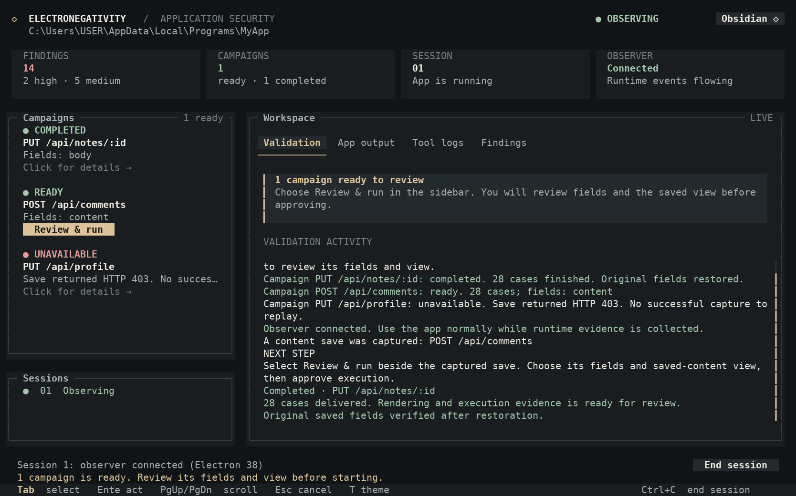
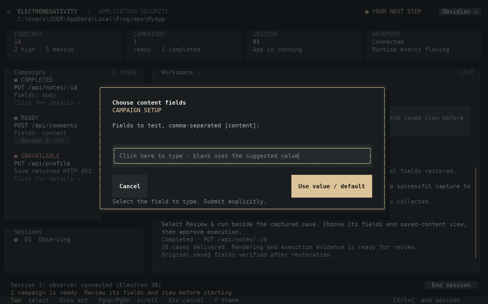
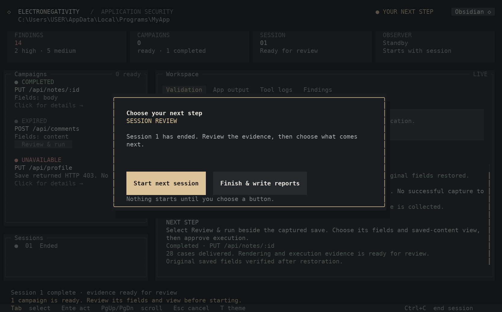
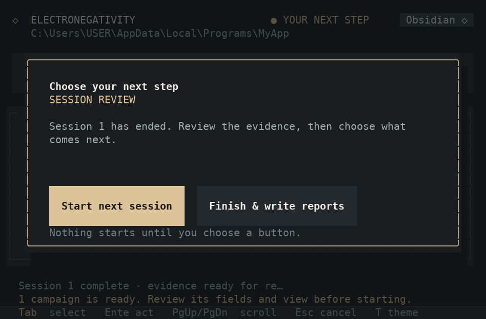

# Windows Terminal / PowerShell TUI checks

Use Node.js as specified in `package.json`, Windows Terminal and PowerShell. Run `npm ci`, then `npm run test:tui`. CI uses Windows runners for lint, the existing regression suite, real Electron observation/proof fixtures and the new TUI workflow fixtures. No Linux or macOS jobs are used for this branch's CI.

The automated tests cover prompt identity, cancellation, stale/repeated input, mouse sequence parsing and hit targets, paste isolation, output separation, terminal restoration, argument compatibility, campaign readiness and scope restrictions. Runtime CI launches real Electron, selects a captured campaign through dashboard mouse input, approves its fields/view, waits for its completion and restoration, then finishes from session review. These tests supply terminal streams; a physical Windows Terminal session remains the check for console mode, font and mouse behavior on the tester's machine.

1. Add `--tui` to a known working `--app` command with `--auto-campaign`, remote/header options, redaction, screenshots and `--prove`. Check that the same output files are produced as for the ordinary CLI.
2. Resize the tab below 77 by 20, then restore it. The workflow should continue while the resize message is shown. At 80 by 24 and 120 by 32 all four log tabs should be accessible.
3. Review the static findings, then click Start next session. Check that app/debug output is under App output and validation instructions are under Validation.
4. Press Enter before any control is selected. It must report that no action started. Save a disposable record and check that its campaign becomes ready with content fields and a case count. Unsupported/failed saves should display their reasons.
5. Click review & run. Submit fields and a view with the keyboard and mouse. Press repeated Enter as each dialog changes; it must not accept the next dialog. Confirm explicitly with Approve.
6. Watch case progress and completed status. Scroll logs and campaign history during app activity. Observe that unavailable/active actions provide feedback rather than queueing an action.
7. Close the app with a campaign dialog open. Its prompt and offers must expire. The session review screen must wait for an explicit Start next session or Finish choice.
8. Start another session, then use End session. Confirm the app closes and evidence is collected. Choose Finish & write reports; open the results folder and close the dashboard. The normal cursor, input and mouse selection should return to PowerShell.
9. Run with `--sessions 0` and `--sessions 2`: no extra manual session prompts should override those counts. Check a normal command without `--tui`, a saved `--watch-log`, and an invalid command with `--tui`; errors must remain readable and retain their CLI exit codes.
10. Switch between Obsidian, Midnight and Porcelain with the theme button or T. Check that text, status labels and keyboard focus are legible. Moving the mouse across a button must never activate it; clicking its top, middle or bottom must select the same action.
11. Open a campaign's details, including an unavailable capture with a long reason. Scroll long dialog text, and verify that clicking behind a dialog cannot activate a campaign or tab. At 80 by 24, session review and text input controls must stay within the window. Repeat with a target path containing accented and wide characters.

`node scripts/preview-tui-windows.mjs` captures six representative screens from the actual renderer on Windows. CI includes these captures for visual review; they represent the terminal cell layout rather than a browser mockup.

## Visual previews

These examples use cell data captured on Windows CI. Text size and glyph shapes depend on your Windows Terminal font; the layout, colours and controls come from the application's renderer.

The default Obsidian theme keeps campaign readiness and your next action visible beside the workspace:

Campaign setup puts input in a focused dialog:

Session review waits for an explicit choice:

The same controls remain usable in an 80-column PowerShell window:

